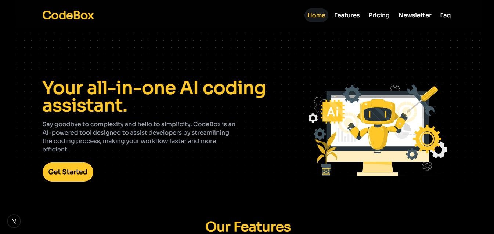

# CodeBox

**CodeBox** is an AI-powered coding assistant that supercharges your development workflow with real-time code suggestions, smart error detection, multi-language support, and more. Built with Next.js and TypeScript, CodeBox delivers a modern, responsive, and intuitive experience for developers. This project is submitted for the [Pulumi Hackathon](https://dev.to/devteam/announcing-the-pulumi-deploy-and-document-challenge-3000-in-prizes-887?) Static website category. and showcases industry-standard UI/UX and robust functionality. **This is jsut a website of a typical application. No backend involved**

[]()
---

## Table of Contents

- [Features](#features)
- [Tech Stack](#tech-stack)
- [Installation](#installation)
- [Usage](#usage)
- [Project Structure](#project-structure)
- [Contributing](#contributing)
- [License](#license)
- [Contact](#contact)

---

## Features

- **AI-Powered Suggestions:** Get intelligent code suggestions in real time.
- **Multi-Language Support:** Works with multiple programming languages and frameworks.
- **Smart Error Detection:** Detect and fix common coding errors before runtime.
- **Interactive Code Search:** Quickly search and navigate your codebase.
- **Auto-Formatting:** Consistent code formatting with a single click.
- **Chat with AI:** Ask coding questions and receive instant, helpful answers.
- **Responsive Design:** A mobile-first approach ensuring a seamless experience across devices.
- **Industry-Standard UI Components:** Built using shadcn/ui for a polished and consistent look.
- **Animated Pricing Toggle:** Smooth, count-up animations for monthly and annual pricing plans.
- **FAQ & Newsletter Sections:** Comprehensive information and subscription options for staying updated.

---

## Tech Stack

- **Framework:** [Next.js](https://nextjs.org/)
- **Language:** [TypeScript](https://www.typescriptlang.org/)
- **Styling:** [Tailwind CSS](https://tailwindcss.com/)
- **UI Components:** [shadcn/ui](https://ui.shadcn.com/)
- **Icons:** [Lucide React](https://lucide.dev/)
- **Animations:** [react-countup](https://www.npmjs.com/package/react-countup)
- **Scrolling:** [react-scroll](https://www.npmjs.com/package/react-scroll)
- **Deployment & Infrastructure:** [Pulumi](https://www.pulumi.com/) (for infrastructure as code in your hackathon project)

---

## Installation

### Prerequisites

- Node.js (v14 or above)
- npm or yarn

### Steps

1. **Clone the Repository:**

   ```bash
   git clone https://github.com/fisayo-dev/codebox_ai_assistant
   cd codebox_ai_assistant

   ```

2. **Install Dependencies:**

   ```bash
   npm install
   # or
   yarn install

   ```

3. **Setup Pulumi (if applicable):**
   Follow the Pulumi Getting Started guide to configure your cloud provider and deploy infrastructure.
4. **Run the Development Server:**

   ```bash
   npm run dev
   # or
   yarn dev

   ```

5. **Build for Production:**
   ```bash
   npm run build
   npm start
   # or
   yarn build && yarn start
   ```

## Usage

- **Home:** A landing page introducing CodeBox.
- **Features:** Explore the key functionalities of CodeBox.
- **Pricing:** Check out our flexible pricing plans with a dynamic toggle for monthly/annual pricing.
- **FAQ:** Find answers to common questions about CodeBox.
- **Newsletter:** Subscribe to receive the latest updates and insights.
- **Footer:** Contains quick links and social media connections to stay engaged with CodeBox.

## Project Stucture

    ```bash
    /codebox
    ├── components
    │   ├── Header.tsx
    │   ├── Features.tsx
    │   ├── Pricing.tsx
    │   ├── Newsletter.tsx
    │   ├── Faq.tsx
    │   └── Footer.tsx
    ├── pages
    │   ├── index.tsx
    │   └── _app.tsx
    ├── public
    ├── styles
    │   └── globals.css
    ├── pulumi (optional)
    │   └── Pulumi.yaml
    ├── package.json
    └── README.md

## Contributing

Contributions are welcome! Feel free to open issues or submit pull requests for any improvements or bug fixes. Please follow the standard [GitHub Flow](https://guides.github.com/introduction/flow/) for contributions.

## Liscence

This project is licensed under the [MIT License](https://tlo.mit.edu/understand-ip/exploring-mit-open-source-license-comprehensive-guide).

## Contact

For questions, feedback, or collaboration opportunities, please contact me, Fisayo Obadina at [olufisayobadina@gmail.com](mailto:olufisayobadina@gmail.com) or connect with me on [Twitter](https://x.com/fisayocoder).

## Happing Coding 😎🚀

This README should provide a clear, detailed overview of your project, installation instructions, and tech stack details, making it ideal for hackathon submissions and professional presentations.
